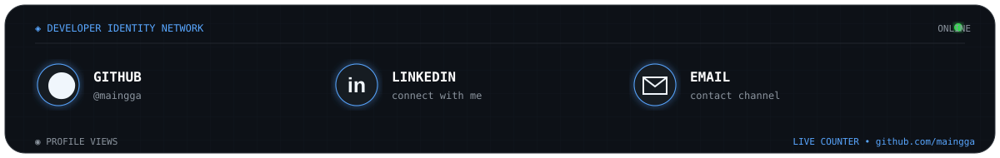
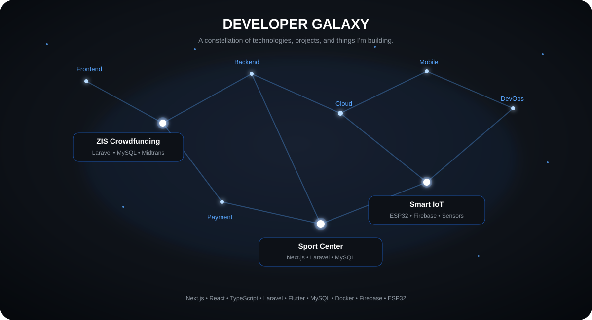
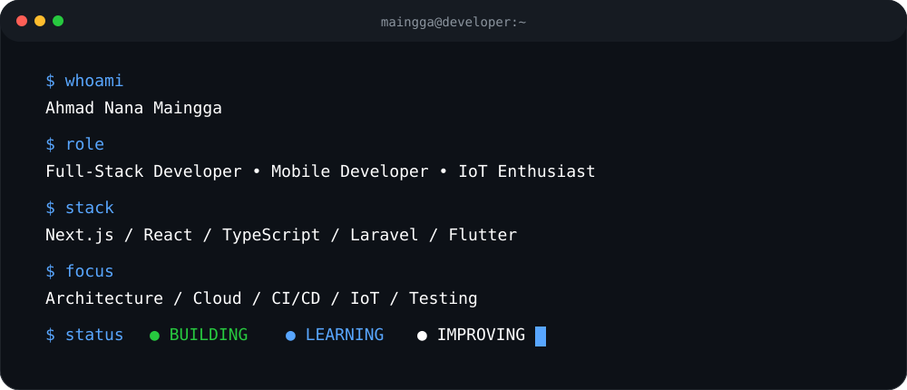
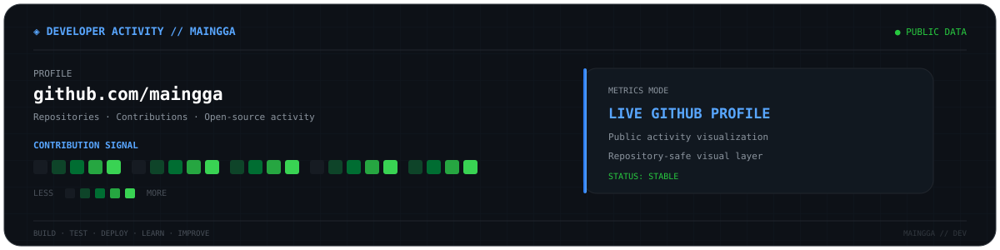

<div align="center">

<!-- 01 — HERO -->


<br>



<br><br>

<!-- 02 — IDENTITY & CONTACT -->


<br><br>

<a href="https://github.com/maingga">GitHub</a>
&nbsp;•&nbsp;
<a href="https://www.linkedin.com/in/ahmad-nana-maingga-b4a82021b">LinkedIn</a>
&nbsp;•&nbsp;
<a href="mailto:ahmad.nanamaingga12@gmail.com">Email</a>

<br><br>


</div>

---


# 01 · 👨‍💻 About

> **Build useful software. Keep the code clean. Keep learning.**

I'm an **Informatics Engineering student** passionate about software development and building useful digital products.

I enjoy working across the stack — from designing interfaces and building APIs to managing databases, integrating payment systems, deploying applications, and experimenting with IoT.

My main interests are **full-stack web development, backend engineering, mobile applications, cloud computing, and IoT systems**.

### Current Focus

- 🔭 Building full-stack web applications
- 🌱 Exploring backend architecture and cloud technologies
- 📱 Developing cross-platform mobile applications
- 🔌 Experimenting with ESP32 and IoT systems
- 🧪 Improving software testing and engineering practices

---

# 02 · ⚡ Engineering Focus

<table>
<tr>
<td width="50%" valign="top">

### 🌐 Web Engineering

Responsive interfaces, scalable applications, API integration, and modern frontend architecture.

**Core:** `Next.js` · `React` · `TypeScript` · `Laravel`

</td>
<td width="50%" valign="top">

### ⚙️ Backend Engineering

REST APIs, authentication, databases, business logic, payment integration, and service architecture.

**Core:** `Laravel` · `Node.js` · `NestJS` · `MySQL`

</td>
</tr>
<tr>
<td width="50%" valign="top">

### 📱 Mobile Engineering

Cross-platform applications with clean UI and reliable backend connectivity.

**Core:** `Flutter` · `Java` · `Firebase`

</td>
<td width="50%" valign="top">

### 🔌 IoT Engineering

Connected systems using microcontrollers, sensors, cloud services, and remote monitoring.

**Core:** `ESP32` · `Arduino` · `Firebase`

</td>
</tr>
</table>

---

# 03 · 🛠️ Technology Command Center

<div align="center">

### FRONTEND


<br>`Next.js` · `React` · `TypeScript` · `Tailwind CSS`

<br><br>

### BACKEND


<br>`Laravel` · `PHP` · `Node.js` · `NestJS`

<br><br>

### MOBILE & IoT


<br>`Flutter` · `Java` · `Android` · `Arduino` · `ESP32`

<br><br>

### DATA & DEVOPS


<br>`MySQL` · `Firebase` · `Docker` · `Git` · `GitHub`

<br><br>

### ENGINEERING TOOLS


<br>`Postman` · `Figma` · `VS Code`

</div>

---

# 04 · 🚀 Featured Missions

### 🕌 Mission 01 — ZIS Crowdfunding Platform

**Web-based crowdfunding platform for Zakat, Infaq, and Shodaqoh focused on transparency and accountability.**

**Highlights:** Online ZIS donations · Zakat calculator · Program management · Midtrans/QRIS · Donation history · Fund distribution · Financial reporting · Program wallet · Masjid wallet · Notifications · Automatic program closure

**Stack:** `Laravel` · `MySQL` · `Tailwind CSS` · `Midtrans` · `QRIS`

---

### 🏸 Mission 02 — Sport Center Reservation

**Full-stack reservation platform for sports facility booking and payment management.**

**Highlights:** Authentication · Facility management · Online booking · Schedules · Payment gateway · DP payment · Transactions · Reservation history · Admin dashboard

**Stack:** `Next.js` · `React` · `Laravel` · `MySQL` · `Midtrans`

---

### 🌱 Mission 03 — Smart IoT Automation

**IoT system connecting sensors, ESP32, cloud services, and applications for monitoring and automation.**

**Highlights:** Sensor monitoring · Automated control · ESP32 integration · Real-time data · Cloud connectivity · Remote monitoring

**Stack:** `ESP32` · `Arduino` · `Firebase` · `Sensors`

---

# 05 · 🌌 Developer Galaxy

<div align="center">



<br><br>

**Every project is a star. Every technology is a connection.**

</div>

| ⭐ Node | Project / Technology | Core Stack |
|---|---|---|
| 🕌 | **ZIS Crowdfunding Platform** | Laravel · MySQL · Midtrans |
| 🏸 | **Sport Center Reservation** | Next.js · Laravel · MySQL |
| 🌱 | **Smart IoT Automation** | ESP32 · Arduino · Firebase |
| ⚡ | **Frontend Engineering** | Next.js · React · TypeScript |
| ⚙️ | **Backend Engineering** | Laravel · Node.js · NestJS |
| 📱 | **Mobile Engineering** | Flutter · Java · Android |
| ☁️ | **Cloud / DevOps** | Docker · Git · GitHub |

---

# 06 · 🖥️ Developer Terminal

<div align="center">



</div>

---

# 07 · 📡 System Architecture

<div align="center">

```text
                         ┌─────────────────┐
                         │      USERS      │
                         └────────┬────────┘
                                  │
              ┌───────────────────┼───────────────────┐
              ▼                   ▼                   ▼
       ┌─────────────┐     ┌─────────────┐     ┌─────────────┐
       │     WEB     │     │   MOBILE    │     │     IoT     │
       │ Next.js     │     │ Flutter     │     │ ESP32       │
       │ React       │     │ Android     │     │ Arduino     │
       └──────┬──────┘     └──────┬──────┘     └──────┬──────┘
              └───────────────────┬┴───────────────────┘
                                  ▼
                         ┌─────────────────┐
                         │    API LAYER    │
                         │ Laravel / Node  │
                         └────────┬────────┘
                                  │
               ┌──────────────────┼──────────────────┐
               ▼                  ▼                  ▼
        ┌─────────────┐    ┌─────────────┐    ┌─────────────┐
        │    MySQL    │    │  Firebase   │    │   Payment   │
        │  Database   │    │    Cloud    │    │   Gateway   │
        └─────────────┘    └─────────────┘    └─────────────┘
                                  │
                                  ▼
                         ┌─────────────────┐
                         │ Docker / Cloud  │
                         └─────────────────┘
```

</div>

---

# 08 · 🧩 Engineering Workflow

<div align="center">

```text
IDEA → ANALYZE → DESIGN → BUILD → TEST → DEPLOY → MONITOR → IMPROVE
  ↑                                                        │
  └────────────────────────── ITERATE ─────────────────────┘
```

</div>

> **Build → Test → Deploy → Learn → Improve.**

---

# 09 · 🌱 Currently Learning

<div align="center">

`System Design` · `Backend Architecture` · `Cloud Computing`

`Docker` · `CI/CD` · `Flutter` · `Software Testing`

</div>

---

# 10 · 📊 Developer Activity

<div align="center">



<br><br>

<a href="https://github.com/maingga">

</a>

</div>

> The main dashboard is repository-local, so it remains available even if external GitHub stats services fail. The activity graph is an optional live visualization.

---

# 11 · 💡 Development Principles

<div align="center">

| **SIMPLE** | **USEFUL** | **CLEAN** | **CONSISTENT** | **IMPROVE** |
|:---:|:---:|:---:|:---:|:---:|
| Avoid unnecessary complexity | Solve real problems | Write maintainable code | Follow predictable patterns | Learn from every iteration |

</div>

---

# 12 · 🤝 Let's Connect

<div align="center">


<br><br>

<a href="https://github.com/maingga">GitHub</a>
&nbsp;•&nbsp;
<a href="https://www.linkedin.com/in/ahmad-nana-maingga-b4a82021b">LinkedIn</a>
&nbsp;•&nbsp;
<a href="mailto:ahmad.nanamaingga12@gmail.com">Email</a>

<br><br>



</div>
