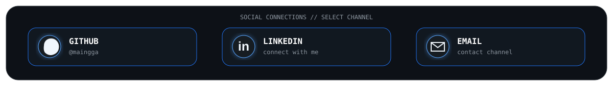

<div align="center">


<br><br>


<br><br>

<a href="https://github.com/maingga"></a>

<br><br>


</div>

---

# 👨‍💻 About Me

> **Build useful software. Keep the code clean. Keep learning.**

I'm an **Informatics Engineering student** passionate about software development and building useful digital products.

I enjoy working across the stack — from designing interfaces and building APIs to managing databases, integrating payment systems, deploying applications, and experimenting with IoT.

My main interests are **full-stack web development, backend engineering, mobile applications, cloud computing, and IoT systems**.

### Currently

- 🔭 Building full-stack web applications
- 🌱 Exploring backend architecture and cloud technologies
- 📱 Developing cross-platform mobile applications
- 🔌 Experimenting with ESP32 and IoT systems
- 🧪 Improving software testing and engineering practices

---

# ⚡ Engineering Focus

<table>
<tr>
<td width="50%" valign="top">

### 🌐 Web Development

Building responsive and scalable web applications using modern frontend technologies and robust backend systems.

**Focus**

`Next.js` · `React` · `TypeScript` · `Laravel`

</td>
<td width="50%" valign="top">

### 📱 Mobile Development

Creating cross-platform mobile applications with clean interfaces and reliable backend integration.

**Focus**

`Flutter` · `Java` · `Firebase`

</td>
</tr>
<tr>
<td width="50%" valign="top">

### ⚙️ Backend Engineering

Designing APIs, authentication systems, databases, payment integrations, and application business logic.

**Focus**

`Laravel` · `Node.js` · `NestJS` · `MySQL`

</td>
<td width="50%" valign="top">

### 🔌 IoT Development

Connecting sensors, microcontrollers, cloud services, and applications to create connected systems.

**Focus**

`ESP32` · `Arduino` · `Firebase`

</td>
</tr>
</table>

---

# 🛠️ Technology Command Center

<div align="center">

### FRONTEND SYSTEM


<br>

`Next.js` · `React` · `TypeScript` · `Tailwind CSS`

<br><br>

### BACKEND SYSTEM


<br>

`Laravel` · `PHP` · `Node.js` · `NestJS`

<br><br>

### MOBILE & IoT SYSTEM


<br>

`Flutter` · `Java` · `Android` · `Arduino` · `ESP32`

<br><br>

### DATA & INFRASTRUCTURE


<br>

`MySQL` · `Firebase` · `Docker` · `Git` · `GitHub`

<br><br>

### ENGINEERING TOOLS


<br>

`Postman` · `Figma` · `VS Code`

</div>

---

# 🚀 Featured Missions

## 🕌 Mission 01 — ZIS Crowdfunding Platform

**A web-based crowdfunding platform for Zakat, Infaq, and Shodaqoh focused on transparency and accountability.**

### Key Features

- Online ZIS donations
- Zakat calculator
- Donation program management
- Payment gateway integration
- Donation history
- Fund distribution management
- Transparent financial reporting
- Program wallet
- Masjid wallet
- Notification system
- Automatic program closure

### Technology

`Laravel` · `MySQL` · `Tailwind CSS` · `Midtrans` · `QRIS`

---

## 🏸 Mission 02 — Sport Center Reservation

**A full-stack reservation platform designed to simplify sports facility booking and payment management.**

### Key Features

- User authentication
- Sports facility management
- Online booking
- Booking schedules
- Payment gateway
- DP payment
- Transaction management
- Reservation history
- Admin dashboard

### Technology

`Next.js` · `React` · `Laravel` · `MySQL` · `Midtrans`

---

## 🌱 Mission 03 — Smart IoT Automation

**An IoT-based system connecting sensors, ESP32, cloud services, and applications for monitoring and automation.**

### Key Features

- Sensor monitoring
- Automated control
- ESP32 integration
- Real-time data
- Cloud connectivity
- Remote monitoring

### Technology

`ESP32` · `Arduino` · `Firebase` · `Sensors`

---

# 🌌 Developer Galaxy

<div align="center">


<br>

**Every project is a star. Every technology is a connection.**

</div>

### ⭐ Galaxy Map

| ⭐ Node | Project / Technology | Core Stack |
|---|---|---|
| 🕌 | **ZIS Crowdfunding Platform** | Laravel · MySQL · Midtrans |
| 🏸 | **Sport Center Reservation** | Next.js · Laravel · MySQL |
| 🌱 | **Smart IoT Automation** | ESP32 · Arduino · Firebase |
| ⚡ | **Frontend Engineering** | Next.js · React · TypeScript |
| ⚙️ | **Backend Engineering** | Laravel · Node.js · NestJS |
| 📱 | **Mobile Engineering** | Flutter · Java · Android |
| ☁️ | **Cloud / DevOps** | Docker · Git · GitHub |

---

# 🖥️ Developer Terminal

<div align="center">


</div>

---

# 📡 System Architecture Mindset

<div align="center">

```text
                         ┌─────────────────┐
                         │      USERS      │
                         └────────┬────────┘
                                  │
              ┌───────────────────┼───────────────────┐
              │                   │                   │
              ▼                   ▼                   ▼
       ┌─────────────┐     ┌─────────────┐     ┌─────────────┐
       │     WEB     │     │   MOBILE    │     │     IoT     │
       │  Next.js    │     │   Flutter   │     │    ESP32    │
       │   React     │     │   Android   │     │   Arduino   │
       └──────┬──────┘     └──────┬──────┘     └──────┬──────┘
              │                   │                   │
              └───────────────────┼───────────────────┘
                                  │
                                  ▼
                         ┌─────────────────┐
                         │    API LAYER    │
                         │ Laravel / Node  │
                         └────────┬────────┘
                                  │
               ┌──────────────────┼──────────────────┐
               │                  │                  │
               ▼                  ▼                  ▼
        ┌─────────────┐    ┌─────────────┐    ┌─────────────┐
        │    MySQL    │    │  Firebase   │    │   Payment   │
        │  Database   │    │    Cloud    │    │   Gateway   │
        └─────────────┘    └─────────────┘    └─────────────┘
                                  │
                                  ▼
                         ┌─────────────────┐
                         │     DOCKER      │
                         │   DEPLOYMENT    │
                         └─────────────────┘
```

</div>

---

# 🧩 Engineering Workflow

<div align="center">

```text
                 ┌──────────────┐
                 │     IDEA     │
                 └──────┬───────┘
                        ↓
                 ┌──────────────┐
                 │    ANALYZE   │
                 └──────┬───────┘
                        ↓
                 ┌──────────────┐
                 │    DESIGN    │
                 └──────┬───────┘
                        ↓
                 ┌──────────────┐
                 │     BUILD    │
                 └──────┬───────┘
                        ↓
                 ┌──────────────┐
                 │     TEST     │
                 └──────┬───────┘
                        ↓
                 ┌──────────────┐
                 │    DEPLOY    │
                 └──────┬───────┘
                        ↓
                 ┌──────────────┐
                 │   MONITOR    │
                 └──────┬───────┘
                        ↓
                 ┌──────────────┐
                 │   IMPROVE    │
                 └──────┬───────┘
                        │
                        └──────────────↺
```

</div>

> **Build → Test → Deploy → Learn → Improve.**

---

# 🌱 Currently Learning

<div align="center">

`System Design` · `Backend Architecture` · `Cloud Computing`

`Docker` · `CI/CD` · `Flutter` · `Software Testing`

</div>

---

# 📊 Developer Activity

<div align="center">


<br><br>

<a href="https://github.com/maingga">

</a>

</div>

> **Note:** The custom activity dashboard above is intentionally repository-local and does not depend on the public `github-readme-stats` endpoint. The activity graph is an optional live visualization.

---

# 💡 Development Principles

<div align="center">

| **SIMPLE** | **USEFUL** | **CLEAN** | **CONSISTENT** | **IMPROVE** |
|:---:|:---:|:---:|:---:|:---:|
| Avoid unnecessary complexity | Solve real problems | Write maintainable code | Follow predictable patterns | Learn from every iteration |

</div>

---

# 🤝 Let's Connect

<div align="center">


<br><br>

**Have an idea, project, or technology to discuss?**

<br>

<a href="https://github.com/maingga">GitHub</a>
&nbsp;•&nbsp;
<a href="https://www.linkedin.com/in/ahmad-nana-maingga-b4a82021b">LinkedIn</a>
&nbsp;•&nbsp;
<a href="mailto:ahmad.nanamaingga12@gmail.com">Email</a>

<br><br>


</div>
